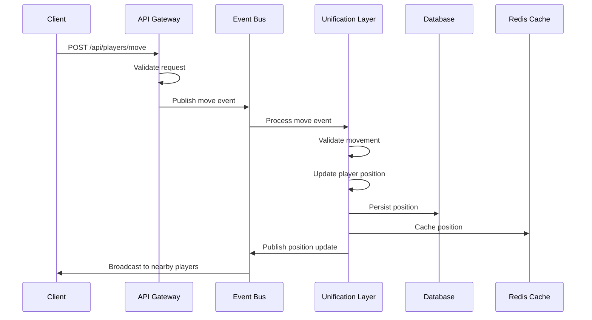
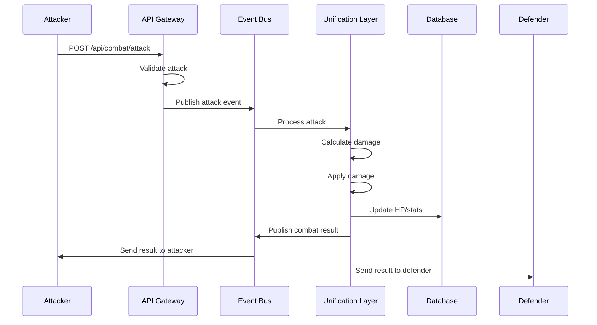

# MMORPG Backend Data Flows

## Overview

This document describes the end-to-end data flows within the MMORPG backend system, from client request to database persistence and real-time updates.

## Core Data Flow Patterns

### 1. Player Authentication Flow

```
Client → API Gateway → Auth Middleware → JWT Validation → Redis Session Check → Response
```

**Steps:**
1. Client sends login request with credentials
2. API Gateway validates request format
3. Auth middleware verifies credentials against database
4. JWT token generated and stored in Redis
5. Response sent to client with token

### 2. Game Action Flow

```
Client → API Gateway → Validation → Event Bus → Unification Layer → State Update → Persistence
```

**Steps:**
1. Client sends game action (movement, combat, etc.)
2. API Gateway validates request and user authentication
3. Request transformed into game event
4. Event published to Redis event bus
5. Unification layer processes event
6. Game state updated in memory
7. State changes persisted to MongoDB
8. Updates broadcast to affected clients

### 3. Real-time Update Flow

```
Game State Change → Event Bus → Subscription Manager → WebSocket → Client
```

**Steps:**
1. Game state change occurs in unification layer
2. Change event published to Redis pub/sub
3. Subscription manager identifies interested clients
4. Real-time updates sent via WebSocket
5. Client receives and applies state changes

## Detailed Flow Diagrams

### Player Movement Flow



### Combat System Flow



## Event Types and Structures

### Player Events
```typescript
interface PlayerEvent {
  id: string;
  type: 'player.move' | 'player.login' | 'player.logout';
  playerId: string;
  regionId: string;
  timestamp: number;
  data: {
    position?: { x: number; y: number; z: number };
    sessionId?: string;
  };
}
```

### Combat Events
```typescript
interface CombatEvent {
  id: string;
  type: 'combat.attack' | 'combat.defend' | 'combat.result';
  attackerId: string;
  defenderId: string;
  regionId: string;
  timestamp: number;
  data: {
    damage?: number;
    skillId?: string;
    result?: 'hit' | 'miss' | 'critical';
  };
}
```

### World Events
```typescript
interface WorldEvent {
  id: string;
  type: 'world.spawn' | 'world.despawn' | 'world.update';
  regionId: string;
  timestamp: number;
  data: {
    entityId?: string;
    entityType?: string;
    position?: { x: number; y: number; z: number };
  };
}
```

## Queue Management

### Priority Levels
- **Critical (1)**: Player authentication, security events
- **High (2)**: Combat actions, real-time interactions
- **Medium (3)**: Movement, chat messages
- **Low (4)**: Statistics updates, background processes

### Queue Processing
- Events processed in priority order
- Batch processing for efficiency
- Dead letter queue for failed events
- Retry mechanisms with exponential backoff

## Data Consistency

### Eventual Consistency Model
- Real-time updates prioritize availability
- Eventual consistency for non-critical data
- Conflict resolution in unification layer
- Periodic synchronization jobs

### Strong Consistency Requirements
- Player authentication state
- Combat outcomes
- Economic transactions
- Critical game state changes

## Error Handling in Data Flows

### Validation Errors
- Schema validation at API gateway
- Business rule validation in unification layer
- Graceful error responses to client

### Processing Errors
- Event retry mechanisms
- Dead letter queue handling
- Compensation transactions
- Error logging and monitoring

### Network Errors
- Connection timeouts
- Retry with exponential backoff
- Circuit breaker pattern
- Graceful degradation

## Performance Considerations

### Batching
- Group related events for processing
- Reduce database round trips
- Optimize network utilization

### Caching Strategy
- Cache frequently accessed data
- Invalidate cache on updates
- Multi-level caching hierarchy

### Database Optimization
- Appropriate indexing
- Query optimization
- Connection pooling
- Read replicas for scaling

## Monitoring Data Flows

### Key Metrics
- Event processing latency
- Queue depth and throughput
- Error rates by flow type
- Database query performance

### Alerting Thresholds
- Queue depth > 1000 events
- Processing latency > 100ms
- Error rate > 1%
- Database connection pool exhaustion

## Security in Data Flows

### Authentication Check Points
- API gateway entry point
- Event processing validation
- Database access control

### Data Sanitization
- Input validation and sanitization
- Output encoding
- SQL injection prevention
- XSS protection

### Audit Trail
- All events logged with context
- User action tracking
- System event recording
- Compliance reporting
