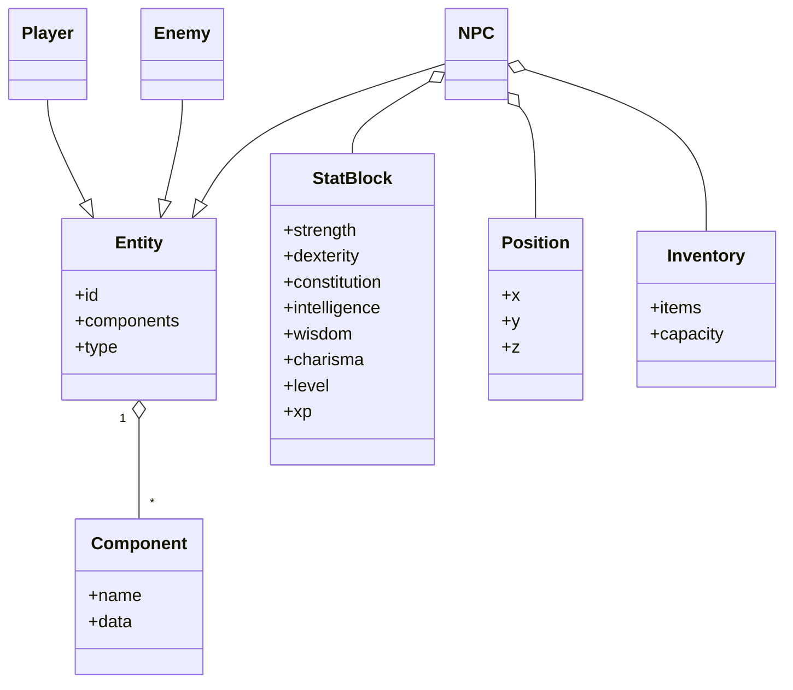
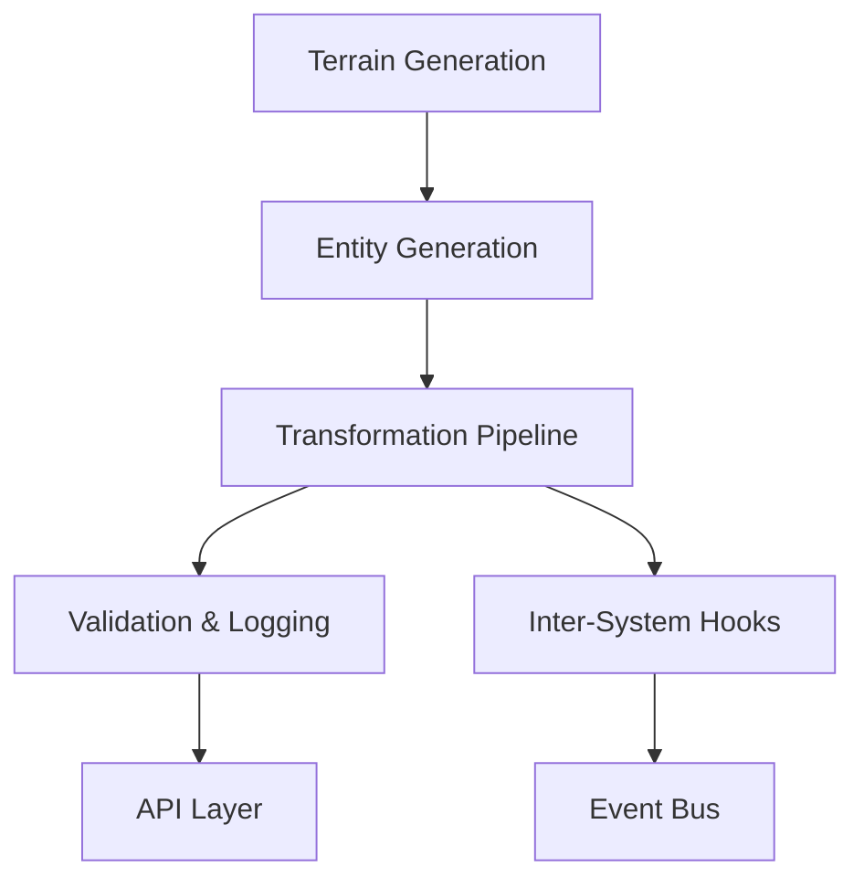

# DunGen - Procedural Generation Engine for MMORPGs

## Complete Project Documentation

---

## Table of Contents

1. [Executive Summary](#1-executive-summary)
2. [Project Overview](#2-project-overview)
3. [System Architecture](#3-system-architecture)
4. [Domain Modeling](#4-domain-modeling)
5. [Core Systems](#5-core-systems)
6. [Procedural Generation](#6-procedural-generation)
7. [Networking & Infrastructure](#7-networking--infrastructure)
8. [Development & Implementation](#8-development--implementation)
9. [Configuration & Extensibility](#9-configuration--extensibility)
10. [Performance & Scaling](#10-performance--scaling)
11. [Testing & Quality Assurance](#11-testing--quality-assurance)
12. [Deployment & Operations](#12-deployment--operations)
13. [Modding & Designer Workflow](#13-modding--designer-workflow)
14. [Technical Specifications](#14-technical-specifications)
15. [Case Studies](#15-case-studies)
16. [Appendices](#16-appendices)

---

## 1. Executive Summary

### 1.1 Project Vision

DunGenMMORPGEngine is a highly-deterministic, server-authoritative, data-driven MMORPG game engine inspired by DnD mechanics. The system leverages Unity's DOTS (ECS, Jobs, Burst), Havok Physics, and advanced procedural content generation, emphasizing extensibility, modularity, and production-grade quality.

### 1.2 Key Objectives

- **Server-Authoritative:** All game logic and state management run on the server
- **Deterministic:** All gameplay outcomes driven by seed-based RNG and fixed-timestep simulation
- **Data-Driven:** All rules, content, and gameplay systems defined externally and loaded at runtime
- **Event-Driven:** All state changes propagate as explicit, traceable events
- **Procedural-First:** All world, dungeon, and item content is procedurally generated
- **Extensible:** All systems are generic, modular, and easily extended

### 1.3 Technology Stack

- **Unity (2022+)** with DOTS (ECS, Jobs, Burst Compiler)
- **Havok Physics** for deterministic simulation
- **C#** as primary programming language
- **YAML/JSON** for configuration and modding
- **WASM modules** for extensible logic
- **gRPC** for networking and communication

---

## 2. Project Overview

### 2.1 Core Principles

- **Server-Authoritative:** All game logic and state management run on the server
- **Deterministic:** All gameplay outcomes are deterministic, driven by seed-based RNG and fixed-timestep simulation
- **Data-Driven:** All rules, content, and gameplay systems are defined externally and loaded at runtime
- **Event-Driven:** All state changes propagate as explicit, traceable events
- **ECS/DOTS:** All gameplay logic is implemented using Unity's ECS for scalability/performance
- **Immutability-in-Transit:** State sent to clients is immutable and validated
- **Centralized Configuration:** All system configs are managed in a single authoritative location
- **Procedural-First:** All world, dungeon, and item content is procedurally generated
- **Comprehensive Logging:** Deep, structured logs for every state transition and event
- **Atomic Transactions:** All state changes are atomic and validated
- **Extensibility:** All systems are generic, modular, and easily extended

### 2.2 Implementation Phases

### Phase 1: Core Infrastructure

- Set up project structure, ECS/DOTS, networking, and logging
- Implement global timer/game loop and deterministic RNG

### Phase 2: Domain Modeling & Systems

- Build entities/components for character sheets, items, world objects, etc.
- Implement core DnD systems: dice, skills, spells, combat

### Phase 3: Procedural Generation

- Integrate Wave Function Collapse, worldgen, dungeon/event/loot generation

### Phase 4: State Sync & Prediction

- Implement server-client sync, prediction/reconciliation, and state validation

### Phase 5: Physics & Performance

- Integrate Havok Physics, optimize ECS jobs and world streaming

### Phase 6: Editor & Tools

- Develop prefab manager/editor windows, central config system

### Phase 7: Testing, Validation, and Polish

- Validation suite, deep logging, polish for extensibility and modding

---

## 3. System Architecture

### 3.1 Architectural Patterns

### Domain-Driven, Modular, Data-Driven, Event-Driven

1. **ECS/DOTS Pattern**
   - All gameplay logic is modeled as **entities** with **components** processed by **systems**
   - Promotes modularity, scalability, and parallelism
2. **Server-Authoritative & Deterministic**
   - All logic and state management is on the server; clients are strictly consumers
   - Seed-based RNG, fixed timestep, atomic transactions for simulation determinism
3. **Data-Driven & Configurable**
   - Game rules, content, and behaviors are defined externally (YAML/JSON)
   - Modular transformation pipeline allows for easy extension of post-processing/enrichment steps
4. **Event-Driven Architecture**
   - All state changes and gameplay actions propagate as explicit, traceable events on a global event bus
   - Inter-system hooks connect subsystems (economy, ranking, quest, social)
5. **Immutability-in-Transit**
   - All state sent to clients is immutable and validated
   - Supports safe rollback/replay and ensures consistency
6. **Comprehensive Logging & Validation**
   - Every meaningful action and transformation is logged for replay, debugging, and analytics
   - Validation runs at every stage to guarantee world consistency

### 3.2 System Logic Flow

1. **Seed-Driven World Initialization**
   - The engine begins by generating world terrain, biomes, and climate using a deterministic seed
   - Guarantees reproducibility and consistent world state across sessions or server deployments
2. **Constraint-Based Entity Generation**
   - All non-terrain entities (NPCs, settlements, events, loot, etc.) are instantiated by resolving constraint sets
   - Constraints are defined in external configuration (YAML/JSON)
   - Algorithms such as Wave Function Collapse (WFC) ensure that generated entities meet all requirements
3. **Transformation Pipeline**
   - The pipeline applies a series of modular enrichment steps to the generated entities
   - Each step is defined as a transformation module
   - The pipeline is fully data-driven, allowing steps to be added, removed, or reordered
4. **Inter-System Hooks**
   - Event-driven hooks connect major systems (ranking, economy, quest, social, etc.)
   - Hooks are registered with the engine and triggered when certain events occur
5. **Validation & Logging**
   - After enrichment, all entities and world state are validated for internal consistency
   - Every transformation, enrichment, and hook-triggered change is logged

### 3.3 Infrastructure Layout

```plaintext
+-------------------------------------------------------------+
|                    Logical Server (Monolith)                |
|  - Embedded Domain Logic (Procedural Gen, Transformation,   |
|    Validation, State Management, Logging)                   |
|  - WASM/Lua/Other UDFs for modular pipeline steps           |
+----------------------+---------------------+----------------+
       |               |                     |
       |               |                     |
+----------------+  +----------------+  +----------------+
|   gRPC Stub 1  |  |   gRPC Stub 2  |  |   gRPC Stub N  |
| (per region,   |  | (per feature,  |  |   (scalable)   |
| feature, or    |  | area, or use   |  |                |
| workflow)      |  | case)          |  |                |
+----------------+  +----------------+  +----------------+
       |               |                     |
       +---------------+---------------------+
                           |
                   [iRPCommands Stream]
                           ↓
                 +------------------------+
                 |      Unity Backend     |
                 |  (Simulation/Clients)  |
                 +------------------------+
```

---

## 4. Domain Modeling

### 4.1 Entities & Components

### Core Entities

- **Players:** Player-controlled characters
- **NPCs:** Non-player characters with AI
- **Enemies:** Hostile entities with combat AI
- **Items:** Equipment, consumables, quest items
- **Spells:** Magical abilities and effects
- **Abilities:** Special skills and powers
- **Projectiles:** Ranged attack objects
- **Tiles:** World building blocks
- **Rooms:** Interior spaces
- **Dungeons:** Complex multi-room structures

### Core Components

- **StatBlock:** Character statistics (STR, DEX, CON, INT, WIS, CHA)
- **Position:** 3D world coordinates
- **Velocity:** Movement vector
- **Inventory:** Item storage and management
- **SkillSet:** Character abilities and proficiencies
- **SpellBook:** Available magical spells
- **Health:** Current and maximum hit points
- **Mana:** Magical energy pool
- **StatusEffects:** Temporary modifiers
- **Faction:** Allegiance and reputation
- **AIState:** Behavioral state for NPCs

### Entity Prefab System

- All entities except Characters/Enemies are prefabs
- Loadable via Editor/Runtime Menu
- Supports rapid prototyping and content creation

### 4.2 DnD-Inspired Data Model

### Character Sheets

- Complete stat blocks with all D\&D attributes
- Skills, abilities, spells, inventory tracking
- Status effects and condition management

### Dice Roll System

- All game mechanics use deterministic dice rolls
- Attack rolls, saving throws, skill checks
- Configurable dice types and modifiers

### Skills/Spells/Abilities

- Modular, data-driven system
- Extensible through ScriptableObjects or JSON
- Support for custom effects and interactions

### Loot Tables

- Modular, weighted probability tables
- Tiered based on procedural generation context
- Support for unique and legendary items

---

## 5. Core Systems

### 5.1 Game Loop & Synchronization

### Global Timer

- **Adjustable Tick Rate:** Fixed time step, adjustable for scaling/performance
- **Server-Driven Loop:** All state changes processed on server, clients receive authoritative state
- **Client Prediction:** Clients run predictive simulations, always reconciling with server state

### State Management

- **Atomic Transactions:** Each game loop tick processes a batch of validated, atomic state changes
- **Event Bus:** All state changes and gameplay actions are events on a global bus
- **Delta Compression & Optimized Sync:** Only changes are sent to clients
- **Immutability:** State in transit is immutable and versioned

### 5.2 DnD Systems

### Attack/Defense Mechanics

- Deterministic dice roll system for all combat
- Attack rolls vs. Armor Class
- Damage rolls with weapon and ability modifiers

### Skill Checks & Saves

- Fully data-driven, extensible for new checks
- Difficulty Class (DC) based challenges
- Advantage/disadvantage system

### Spells & Abilities

- Modular system for design and execution
- Spell slots and resource management
- Area of effect and targeting systems

### 5.3 Action System

### Real-Time Combat

- Chainable abilities/attacks with deterministic outcomes
- Initiative-based turn order
- Interrupt and reaction systems

### Boss Fights/Raids

- Mechanically rich, procedurally generated encounters
- Multi-phase boss battles
- Dynamic difficulty scaling

### Dynamic World Events

- Player actions can permanently alter world state
- Consequences cascade through interconnected systems
- Historical tracking of major events

---

## 6. Procedural Generation

### 6.1 World Generation

### Wave Function Collapse (WFC)

- Used for world/dungeon layout generation
- Terrain feature placement
- Room connectivity and flow

### Biome & Region Generation

- Procedural climate and weather systems
- Resource distribution and scarcity
- Cultural and technological variations

### Dungeon/Room Generation

- Multi-tiered dungeon complexes
- Unique layouts with guaranteed solvability
- Boss rooms and special encounters
- Random events and environmental hazards

### 6.2 Content Generation

### NPC/Enemy Generation

- Procedural stat blocks based on level and role
- AI behavioral profiles and motivations
- Dynamic relationship networks

### Loot/Item Generation

- Procedural item stats and properties
- Rarity tiers and unique modifiers
- Context-appropriate item placement

### Event Generation

- World events with cascading consequences
- Boss spawns and rare encounters
- Player-driven narrative branches

### 6.3 Procedural Generation Workflow

### 1. Terrain Generation (Seed-Driven)

- World terrain, biomes, and climate generated using deterministic seed

### 2. Constraint-Driven Generation (Non-Terrain Content)

- All non-terrain world entities generated by resolving constraint sets through WFC
- Constraints cover demographic ratios, economic tiers, profession distributions
- Entropy and weighted randomness ensure variety while meeting constraints

### 3. Transformation Pipeline (Post-Processing)

- **Purpose:** Modular, configurable step after base procedural object placement
- **Input:** Base objects/entities generated by constraint system
- **Process:**
  - Reads transformation configuration for each entity type
  - Applies additional game objects, features, or relationships
  - May spawn "helper" game objects (shops, guilds, landmarks)
  - Ensures thematic, narrative, and gameplay focus
  - Can incorporate player-driven or dynamic world state
- **Output:** Finalized, enriched set of game objects ready for simulation

### 4. Validation & Logging

- Validates that all enriched models are internally consistent
- Logs all transformation steps for replay, debugging, and analytics

### 6.4 Example: Population/Settlement Generation

1. **Constraint-Driven Phase:**
   - Generate 500 citizens for a town with specific demographic ratios
   - Men:women ratios, single:married, professions, age distributions
2. **Transformation Pipeline:**
   - Assign family relationships, backstories, and roles
   - Equip citizens with context-appropriate items
   - Place shops, guilds, and social structures
   - Add narrative hooks and personal quests

---

## 7. Networking & Infrastructure

### 7.1 Server Architecture

### Headless Unity Server

- All game logic, worldgen, and simulation run server-side
- Authoritative state management
- Deterministic simulation with fixed timestep

### Stateless Clients

- Clients handle prediction, rendering, and input only
- Never authoritative logic
- Always reconcile with server state

### State Synchronization

- Real-time, efficient synchronization
- Delta compression for bandwidth optimization
- Rollback/replay support for prediction reconciliation

### 7.2 Determinism

### Seeded RNG

- All random events use server-assigned seeds
- Reproducible results across sessions
- Support for replay and debugging

### Fixed-Point Math

- Used where float drift could cause desyncs
- Consistent calculations across platforms
- Deterministic physics simulation

### Lockstep/Replay

- All user actions are replayable
- Server validation of all inputs
- Complete audit trail of game state changes

### 7.3 Load Balancing & Scalability

### Multi-Tier Load Balancing

- **Edge (client connections):** Geographic distribution
- **API (service routing):** Feature-based routing
- **DB (sharding):** Region-based data partitioning

### Microservices Architecture

- **Each game service runs independently**
- **Benefits:** Flexibility, modular scaling, language agnostic
- **Tools:** Docker, Kubernetes, gRPC, REST

### Event-Driven Architecture

- **World events published to event bus**
- **Benefits:** Decoupling, real-time updates, replay, analytics
- **Tools:** Kafka, Redis Streams, RabbitMQ

### 7.4 Recommended Infrastructure Stack

| Layer           | Options/Tools                                | Considerations                               |
| --------------- | -------------------------------------------- | -------------------------------------------- |
| Networking      | Nginx, Envoy, Cloudflare, AWS ELB            | SSL/TLS, DDoS protection, geo-routing        |
| API Gateway     | Envoy, Kong, AWS API Gateway                 | Rate limiting, request authentication        |
| Service Mesh    | Istio, Linkerd, Consul                       | Service discovery, traffic control, tracing  |
| Compute         | Kubernetes, Nomad, ECS, GKE                  | Auto-scaling, rolling deploys, resource mgmt |
| DB (Hot State)  | Redis, Aerospike, Tarantool                  | In-memory, sharded, Lua/WASM logic           |
| DB (Cold State) | PostgreSQL, MongoDB, S3                      | Durability, backup, document/relational      |
| Event Bus       | Kafka, Redis Streams, RabbitMQ               | Decoupled, replay, analytics                 |
| Monitoring      | Prometheus, Grafana, Jaeger, ELK/EFK, Sentry | Metrics, logs, tracing, alerts               |

---

## 8. Development & Implementation

### 8.1 Codebase Structure

### Directory Organization

```
/src/ — Main engine source code
├── /terrain/ — Terrain generation modules
├── /entities/ — Entity generation logic (NPCs, settlements, etc.)
├── /transformation/ — Transformation pipeline steps and enrichment modules
├── /economy/ — Economy, vendors, crafting, loot
├── /ranking/ — Ranking and ladder logic
├── /quest/ — Quest and event systems
├── /combat/ — Combat, stats, modifiers
├── /social/ — Guilds, relationships, announcements
├── /hooks/ — Inter-system hooks
├── /api/ — API endpoints & integration layer
├── /validation/ — Validation & logging
└── /config/ — Default config files, templates, constraints

/tests/ — Unit and integration tests
/docs/ — Documentation and guides
```

### Naming Conventions

- Use `PascalCase` for class and module names
- Use `snake_case` for configuration file names
- Prefix transformation steps with `Transform` (e.g., `TransformAssignRoles`)
- Suffix hooks with `Hook` (e.g., `RankToEconomyHook`)
- Configuration templates use descriptive names: `npc_base.yaml`, `settlement_market.yaml`

### 8.2 Programming Philosophy

### Core Principles

1. **Modularity and Separation of Concerns**
   - All major systems are independent modules with well-defined interfaces
   - Each system responsible for single domain of logic
   - Communication through explicit hooks or pipeline stages
2. **Data-Driven Design**
   - Configurations, constraints, and enrichment logic specified through external data files
   - Designers and modders can adjust world generation without changing engine code
   - Maximizes flexibility and supports rapid iteration
3. **Determinism and Replayability**
   - Procedural generation is seeded for exact reproduction
   - All transformation and enrichment steps are logged
   - Supports robust testing, analytics, and persistent simulation states
4. **Extensibility and Customization**
   - Engine designed to allow new systems, transformation steps, hooks, and content types
   - Minimal friction for developers and designers to inject new logic or content
5. **Validation and Consistency**
   - All outputs validated for constraint satisfaction and internal consistency
   - Errors and edge cases logged for review
   - Supports quality assurance and world stability
6. **Event-Driven Inter-System Communication**
   - Systems communicate through modular hooks
   - Dynamic world events trigger updates in other systems
   - Supports reactive, interconnected game world

### 8.3 ECS Architecture Implementation

### Entities

- **Definition:** Unique identifiers representing discrete game objects
- **Examples:** NPCs, towns, shops, items, quest triggers, landmarks, events
- **Characteristics:** Entities contain no data—only serve as references to component collections

### Components

- **Definition:** Modular data containers representing single aspects of entities
- **Examples:** Position, Health, Inventory, Profession, Relationship, Backstory
- **Characteristics:**
  - Highly granular and reusable
  - Components are pure data with no logic
  - Entities gain behavior through component composition

### Systems

- **Definition:** Processes operating over entities with particular components
- **Examples:** MovementSystem, CombatSystem, TransformationPipelineSystem
- **Characteristics:**
  - Systems are stateless, acting as pure functions
  - Modular, extendable, and data-driven
  - Decoupled logic enables scalability

---

## 9. Configuration & Extensibility

### 9.1 Configuration System

### Config File Structure

Located in `/config/`:

- `engine.yaml` — Global engine parameters
- `npc_base.yaml` — NPC archetypes
- `settlement_market.yaml` — Settlement templates
- `constraints.yaml` — Demographic, economic, social constraints
- `hooks.yaml` — Registered inter-system hooks

### Supported Fields & Parameters

Each template supports:

- `id`, `type`, `properties` (customizable fields)
- `constraints` (rules for generation and relationships)
- `enrichment_steps` (transformation modules to apply)
- `inherit` (base template to extend)

### 9.2 Generic Templating System

### Purpose

Provides flexible, reusable mechanism for defining entities, transformation steps, and content patterns in external configuration files.

### Key Concepts

**Templates:**

- Defined in YAML/JSON files
- Represent entity archetypes (NPC, settlement, item, quest, event, etc.)
- Include parameterized fields, constraints, and optional enrichment logic
- Support inheritance for specialized roles or variants

**Template Resolution:**

- Engine resolves templates by filling parameters based on constraints and world context
- Transformation pipeline reads templates to apply enrichment steps
- Supports role assignment, quest injection, and helper object spawning

**Extending Templates:**

- Developers and designers create new templates by adding configuration files
- Existing templates can be extended or overridden
- Transformation steps reference templates by type

### 9.3 Transformation Pipeline Extension

### Pipeline Configuration

```yaml
steps:
  - name: AssignRoles
    config: config/roles.yaml
  - name: EquipItems
    config: config/equipment.yaml
  - name: AssignEncounters
    config: config/encounters.yaml
```

### Adding New Steps

1. Implement enrichment logic in new class implementing `ITransformationStep`
2. Create corresponding YAML config for the step
3. Register step in `TransformationStepFactory`
4. Add step reference to pipeline YAML

### Modding Support

- Designers can add, edit, or remove YAML config files
- Steps can be re-ordered or replaced by changing pipeline YAML
- All steps log actions for replay/debugging

---

## 10. Performance & Scaling

### 10.1 Physics & Performance

### Havok Physics Integration

- **ECS Physics:** Use Havok for high-fidelity, deterministic simulation
- **Performance:** Burst-compiled jobs, multithreaded ECS
- **Optimization:** Culling and pooling for large world support

### Performance Targets

- **Latency:** <50ms region tick
- **Throughput:** >100k req/sec/node
- **Availability:** 99.99%+
- **Fault Tolerance:** Zero downtime zones

### 10.2 Scaling Strategies

### Scaling Tips

- Use distributed terrain/entity generation for large worlds
- Optimize transformation steps for batch processing
- Profile using built-in .NET tools or external profilers

### Optimization Targets

- Focus on bottlenecks in constraint solving and transformation
- Cache results of expensive operations
- Use logs and profiling reports to identify slow steps

### Region-Based Sharding

- **Each region** is a logical grouping with own pipeline execution
- **Global State Machine** manages cross-region events
- **Isolation** supports parallel development and fault tolerance

### 10.3 WASM Module Support

### What is WASM?

- **WebAssembly (WASM):** Portable, binary instruction format
- **Key features:** Safe, fast, embeddable in servers and DBs
- **Cross-platform:** Language-agnostic logic execution

### Why WASM for DB/Backend Logic?

- **Unification:** Enables running logic modules directly inside database
- **Extensibility:** DB vendors adding WASM extension points
- **Sandboxing:** Prevents rogue code from affecting stability
- **Performance:** Near-native speed

### WASM Integration Flow

1. **C#/.NET game server** compiles backend logic as WASM modules
2. **DB** loads WASM modules for custom queries, triggers, validations
3. **Lua endpoints** remain as atomic validators
4. **WASM modules** handle complex game logic and transformations

---

## 11. Testing & Quality Assurance

### 11.1 Testing Strategy

### Test Categories

- **Unit tests** for modules in `/tests/unit/`
- **Integration tests** for pipeline and hooks in `/tests/integration/`
- **Regression tests** for world generation in `/tests/regression/`

### Running Tests

```sh
dotnet test
```

### Continuous Integration

- GitHub Actions config in `.github/workflows/ci.yaml`
- CI runs tests on every push/PR
- Automated validation of configs and schemas

### 11.2 Validation & Logging

### Log Storage

All logs stored in `/logs/`:

- `transformation.log`
- `validation.log`
- `hooks.log`

### Reading & Interpretation

- Each log entry includes timestamp, step, entity, and detail
- Validation errors list entity ID and failed constraint
- Transformation logs enable step-by-step replay

### Debugging & Replay

- Use transformation logs to replay steps and diagnose issues
- Validation failures can be traced to config or pipeline steps
- Complete audit trail supports forensic analysis

---

## 12. Deployment & Operations

### 12.1 Setup & Getting Started

### Prerequisites

- .NET 8.0 (or chosen runtime)
- Python 3.11+ (for auxiliary tools, optional)
- Node.js 18+ (if using API server or front-end)
- YAML/JSON parser libraries

### Building

```sh
cd src/
dotnet build
```

### Running

```sh
dotnet run --project src/DunGenMMORPGEngine.csproj
```

### First-Time Setup

- Edit `/config/engine.yaml` to set world seed and generation parameters
- Run `dotnet run` to generate the initial world
- Review logs in `/logs/` for validation output

### 12.2 Release Process & Versioning

### Managing Releases

- Tag all releases in Git
- Use semantic versioning (`v1.2.3`)
- Maintain `CHANGELOG.md` in root

### Version Compatibility

- Document breaking changes in release notes
- Support config migration scripts if needed
- Backwards compatibility for templates and configs

### 12.3 Security Considerations

### Securing APIs & Data

- Use HTTPS for all API endpoints
- Restrict sensitive endpoints to admins/designers
- Validate all external config before loading

### Common Pitfalls

- Never expose internal admin APIs to public
- Watch for template/config injection attacks
- Implement proper authentication and authorization

---

## 13. Modding & Designer Workflow

### 13.1 Designer Empowerment

### Content Creation Workflow

- Designers edit templates and constraints in `/config/`
- No code changes required for most content additions
- Use inheritance and parameterization for templates

### Supported Tools

- VS Code, JetBrains Rider, or any YAML/JSON editor
- Optional: Custom config validation scripts
- Real-time validation and error checking

### 13.2 Advanced Subsystems for Modding

### Combat Actions & Conditions

- Add/modify combat actions in `config/combat_actions.yaml`
- Define custom status effects and interactions

### AI/Behavior Profiles

- Define archetypes, motivations, and fears in `config/personalities.yaml`
- Behavioral state machines and decision trees

### Factions & Reputation

- Add factions and reputation logic in `config/factions.yaml`
- Dynamic relationship systems

### Quests & Story Hooks

- Templates in `config/quest_templates.yaml`
- Dynamic quest assignment and tracking

### Event/Trigger System

- Add triggers and effects in `config/event_triggers.yaml`
- World-changing events and consequences

### 13.3 Modding Guidelines

- Avoid direct code changes when possible
- Use inheritance and parameterization for templates
- All subsystems are data-driven and extensible
- Add new templates, archetypes, factions, quests with no code changes

---

## 14. Technical Specifications

### 14.1 API Documentation

### Endpoints

- `GET /api/leaderboard` — Retrieve ladder/rankings
- `GET /api/world-state` — Get current world data
- `POST /api/events` — Trigger/resolve world events
- `GET /api/entity/{id}` — Query entity details

### Example Request/Response

```json
GET /api/leaderboard
{
  "ladder": "dragons_defense_pve",
  "entries": [{ "id": "npc_123", "rank": 1, "score": 999 }]
}
```

### Authentication & Permissions

- API keys or OAuth supported
- Permission levels: `admin`, `designer`, `player`, `modder`

### 14.2 Hook System

### Registering Hooks

Define hooks in `/config/hooks.yaml`:

```yaml
- trigger_type: "RankChange"
  source_system: "Ranking"
  target_system: "Economy"
  action: "GrantDiscount"
```

### Example Use Cases

- Rank promotion triggers economic perks
- Quest completion triggers social reputation updates
- Combat events affect faction relationships

### Troubleshooting

- Check logs in `/logs/hooks.log` for errors
- Ensure hook registration matches config and code
- Validate hook dependencies and execution order

### 14.3 Data Typing & Serialization

### Logical Stack Typing

| Layer                   | Logical Type                                 | Example Objects                          |
| ----------------------- | -------------------------------------------- | ---------------------------------------- |
| Seed/Terrain Gen        | `Seed`, `TerrainMap`, `BiomeMap`, `Climate`  | `Seed: int`, `TerrainMap: array`         |
| Constraint System       | `ConstraintSet`, `EntityTemplate`, `WFCGrid` | Demographic ratios, profession templates |
| Generated Entities      | `NPC`, `Town`, `Event`, `Structure`, `Loot`  | `NPC: struct`, `Town: struct`            |
| Transformation Pipeline | `TransformStep`, `Config`, `EnrichedEntity`  | Assign roles, equip items                |
| Final Output            | `GameObject`, `SimulationModel`, `Quest`     | Ready for gameplay/simulation            |

### Serialization Strategy

| Authoring Source | Runtime Format       | Transport/Storage   | Consumed By                     |
| ---------------- | -------------------- | ------------------- | ------------------------------- |
| YAML/JSON        | FlatBuffers/Protobuf | DB, Network, Memory | WASM modules, Unity, Simulation |
| YAML (designer)  | FlatBuffers          | DB blob             | Unity, client/server            |
| JSON (modders)   | FlatBuffers/Protobuf | Network             | Engine/client                   |

---

## 15. Case Studies

### 15.1 WASM Pipeline Orchestration

### Region Pipeline Example: Town of Willowbrook

**Pipeline Steps** (executed as WASM modules):

1. **Terrain Generation**
   - Input: Seed, biome config
   - Output: Terrain mesh, biome map
2. **Constraint-Driven Generation**
   - Input: Town config (population, ratios, economic tiers)
   - Output: Raw citizen entities, shops, NPCs
3. **Transformation Pipeline**
   - Input: Entities + transformation configs
   - Output: Enriched NPCs (roles, items, relationships), unique locations
4. **Validation & Logging**
   - Input: Enriched objects
   - Output: Validated region state, transformation log

### Sample WASM Pipeline Orchestrator (Rust + Wasmtime)

### Sample WASM Pipeline Orchestrator (Rust + Wasmtime)

```rust
use wasmtime::{Engine, Module, Store, Instance, Func};
use serde_json::Value;

fn run_wasm_stage(wasm_bytes: &[u8], input_json: &Value) -> Value {
    let engine = Engine::default();
    let module = Module::new(&engine, wasm_bytes).unwrap();
    let mut store = Store::new(&engine, ());
    let instance = Instance::new(&mut store, &module, &[]).unwrap();

    // Assumes WASM module exports a "process" function
    let process: Func = instance.get_func(&mut store, "process").unwrap();
    let result_json = process.call(&mut store, &[input_json]).unwrap();
    serde_json::from_slice(result_json).unwrap()
}

// Example pipeline orchestration
fn main() {
    let terrain_wasm = std::fs::read("terrain_gen.wasm").unwrap();
    let constraint_wasm = std::fs::read("entity_gen.wasm").unwrap();
    let transform_wasm = std::fs::read("transform.wasm").unwrap();
    let validate_wasm = std::fs::read("validate.wasm").unwrap();

    let seed_config = json!({"seed": 12345, "biome": "temperate"});
    let terrain = run_wasm_stage(&terrain_wasm, &seed_config);

    let town_config = json!({
        "town": "Willowbrook",
        "population": 500,
        "demographics": {...}
    });
    let entities = run_wasm_stage(&constraint_wasm, &town_config);

    let transform_config = json!({"npc_rules": {...}, "item_tables": {...}});
    let enriched = run_wasm_stage(&transform_wasm, &entities);

    let validation = run_wasm_stage(&validate_wasm, &enriched);

    println!("Final region state: {:?}", validation);
}
```

### Transformation WASM Module Logic (Rust)

```rust
// This module is compiled to WASM and loaded by the orchestrator
#[no_mangle]
pub extern "C" fn process(input_ptr: *const u8, input_len: usize) -> *const u8 {
    let input = unsafe { std::slice::from_raw_parts(input_ptr, input_len) };
    let entities: Vec<Entity> = serde_json::from_slice(input).unwrap();

    let enriched = entities.into_iter().map(|mut e| {
        e.assign_role();
        e.equip_items();
        e.link_family();
        e.add_backstory();
        e
    }).collect::<Vec<_>>();

    let output = serde_json::to_vec(&enriched).unwrap();
    output.as_ptr()
}
```

### 15.2 Multi-Region Pipeline Architecture

### Deployment Diagram

```plaintext
+----------------+       +------------------+       +------------------+
|  Region 1      |       |   Region 2       |       |   Region N       |
|  Pipeline      |       |   Pipeline       |       |   Pipeline       |
| (WASM stages)  |       | (WASM stages)    |       | (WASM stages)    |
+-------+--------+       +--------+---------+       +--------+---------+
        |                         |                        |
        |                         |                        |
        v                         v                        v
+------------------+    +-------------------+    +-------------------+
| Region State DB  | <- | Global State Sync | -> | External Systems   |
+------------------+    +-------------------+    +-------------------+
        |                         |
        v                         v
+---------------------+   +---------------------+
| Logging/Audit Store |   | Monitoring/Analytics|
+---------------------+   +---------------------+
```

### Key Advantages

- **Performance:** WASM modules run with near-native speed; pipeline can be parallelized per region
- **Modularity:** Each step is a WASM module—hot-swappable and versioned for rapid iteration
- **Security:** WASM sandboxing prevents malicious or buggy code from corrupting world state
- **Designer/Modder Friendly:** Transformation pipeline rules and modules can be data-driven and extended
- **Auditability:** Full transformation and validation logs at every step
- **Scalability:** Easily scale by adding regions or parallel orchestrators

### 15.3 Database Selection & Integration Case Study

### Requirements Satisfaction

Our procedural MMO world requires a data architecture that supports:

- High-performance generation, transformation, and simulation
- Modular, extensible enrichment (transformation pipeline)
- Efficient and reliable storage/retrieval of world state and entities
- Scalable real-time operations for thousands of concurrent players
- Deep integration between C#, database, and backend logic

### WASM-Unified Logic Flow

```plaintext
[Unity Client]
   ↓ input/output
[gRPC Service Layer]          [ WASM Logic Modules (.NET, Rust, etc.) ]
   ↓                        ↗︎
[In-Memory DB (Redis/Aerospike/Postgres/Tarantool)]
   ↔︎ (WASM extension points, Lua endpoints for validation)
[Transformation Pipeline, Hydrators]
   ↓
[Persistent DB]
```

### WASM Integration Benefits

| Factor      | Benefits                               | Challenges / Trade-Offs               |
| ----------- | -------------------------------------- | ------------------------------------- |
| Performance | Near-native, multi-language support    | Start-up overhead, debugging          |
| Security    | WASM sandboxing, resource limits       | Still maturing; must audit extensions |
| Flexibility | Run C#, Rust, Go, etc. in DB layer     | DB must support WASM extensions       |
| Integration | Deep logic in DB, unified dev workflow | Not all DBs support WASM yet          |
| Modularity  | Hot-swappable modules, versioning      | Dependency management, module loading |

---

## 16. Appendices

### 16.1 Glossary & Concept Reference

- **Constraint**: Rules governing entity generation (e.g., demographic balance, economic tiers)
- **Transformation**: Post-processing step that enriches an entity (roles, items, relationships)
- **Hook**: Event-driven connector between systems (e.g., ranking to economy)
- **Template**: Configuration archetype for an entity, transformation, or system
- **Seed**: Value used for deterministic world generation
- **Wave Function Collapse (WFC)**: Algorithm for constraint-based generation
- **Enrichment**: Adding gameplay, narrative, or context to entities
- **Pipeline**: Sequence of steps applied to generated entities
- **Validation**: Ensures generated content satisfies all constraints
- **Replayability**: Ability to reproduce world state and transformation steps from logs
- **ECS**: Entity Component System architecture pattern
- **DOTS**: Data-Oriented Technology Stack (Unity)
- **WASM**: WebAssembly - portable binary instruction format
- **gRPC**: High-performance RPC framework
- **Deterministic**: Producing the same results given the same inputs
- **Server-Authoritative**: Game logic runs on server, clients are consumers only
- **Event-Driven**: Architecture where components communicate through events
- **Data-Driven**: Systems configured through external data rather than code

### 16.2 References & Resources

### Technical Documentation

- [Unity DOTS Documentation](https://docs.unity3d.com/Packages/com.unity.entities@latest)
- [Havok Physics for Unity](https://docs.unity3d.com/Packages/com.havok.physics@latest)
- [gRPC Documentation](https://grpc.io/docs/)
- [WebAssembly Specification](https://webassembly.github.io/spec/)
- [Wasmtime Runtime Documentation](https://docs.wasmtime.dev/)

### Architecture & Design Patterns

- [Entity Component System FAQ](https://github.com/SanderMertens/ecs-faq)
- [Data-Oriented Design](https://dataorienteddesign.com/dodbook/)
- [Event-Driven Architecture Patterns](https://microservices.io/patterns/data/event-driven-architecture.html)
- [CQRS Pattern](https://martinfowler.com/bliki/CQRS.html)

### Game Development Resources

- [Procedural Content Generation in Games](https://link.springer.com/book/10.1007/978-3-319-42716-4)
- [Game Programming Patterns](https://gameprogrammingpatterns.com/)
- [Real-Time Rendering](https://www.realtimerendering.com/)

### Infrastructure & DevOps

- [Kubernetes Documentation](https://kubernetes.io/docs/)
- [Docker Best Practices](https://docs.docker.com/develop/dev-best-practices/)
- [Microservices Patterns](https://microservices.io/patterns/)
- [Site Reliability Engineering](https://sre.google/books/)

### 16.3 System Diagrams

### Entity/Class Diagram



### Functions/Subsystem Diagram



### 16.4 Configuration Examples

### Sample NPC Template (npc\_base.yaml)

```yaml
id: "npc_base"
type: "NPC"
inherit: null
properties:
  health:  
    min: 50
    max: 100
  profession: "random"
  age:
    min: 18
    max: 65
constraints:
  - demographic_balance
  - profession_availability
enrichment_steps:
  - assign_role
  - equip_items
  - link_relationships
  - add_backstory
```

### Sample Transformation Step (assign\_role.yaml)

```yaml
step_name: "assign_role"
description: "Assigns professional roles to NPCs based on settlement needs"
inputs:
  - npc_entities
  - settlement_context
outputs:
  - enriched_npcs
rules:
  - if: "settlement.type == 'town'"
    then: "assign_from_town_roles"
  - if: "settlement.type == 'village'"
    then: "assign_from_village_roles"
validation:
  - check_role_constraints
  - verify_skill_requirements
```

### 16.5 Performance Benchmarks

### Target Metrics

| Metric                 | Target                  | Measurement Method                 |
| ---------------------- | ----------------------- | ---------------------------------- |
| World Generation Time  | <30 seconds for 100km²  | Time from seed to playable world   |
| Entity Processing Rate | >10,000 entities/second | Transformation pipeline throughput |
| Memory Usage           | <8GB for large world    | Peak memory during generation      |
| Network Latency        | <50ms regional          | Client-server round trip time      |
| Concurrent Players     | >1,000 per region       | Simultaneous active connections    |

### 16.6 Troubleshooting Guide

### Common Issues

**World Generation Fails**

- Check seed validity and configuration syntax
- Verify constraint satisfaction in logs
- Ensure all required templates are present

**Transformation Pipeline Errors**

- Review transformation step logs
- Validate YAML/JSON configuration files
- Check template inheritance chains

**Performance Issues**

- Profile memory usage during generation
- Monitor CPU utilization across pipeline stages
- Check for constraint solving bottlenecks

**Networking Problems**

- Verify gRPC service connectivity
- Check firewall and port configurations
- Monitor bandwidth usage and compression

### 16.7 Future Roadmap

### Short-term Goals (3-6 months)

- Complete core ECS implementation
- Basic procedural world generation
- Initial transformation pipeline
- Simple networking layer

### Medium-term Goals (6-12 months)

- Full WASM integration
- Advanced AI and behavioral systems
- Comprehensive modding support
- Load balancing and scaling

### Long-term Goals (12+ months)

- Machine learning-enhanced generation
- Advanced physics simulation
- Cross-platform client support
- Enterprise deployment tools

### 16.8 Contributing Guidelines

### Code Standards

- Follow C# coding conventions
- Use meaningful variable and function names
- Document all public APIs
- Write unit tests for new features

### Configuration Standards

- Use consistent YAML formatting
- Validate all configuration files
- Document template inheritance
- Provide usage examples

### Review Process

- All changes require peer review
- Automated testing must pass
- Documentation must be updated
- Performance impact must be assessed

---

**Document Version:** 1.0  
**Last Updated:** 2024  
**Authors:** DunGen Development Team  
**Status:** Living Document

---

*This documentation is a living document and will be updated as the project evolves. For the latest version, please refer to the project repository.*